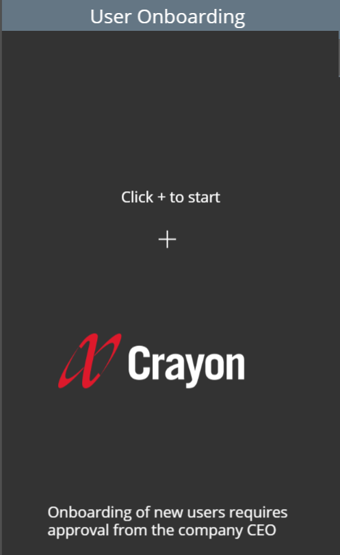

# User Management Automation

User Management Automation is a set of templates for setting up automation around the processes of on- and offboarding of users in an organization, as well as changes to existing ones.

On a high level, it supports 2 scenarios:
1. User on- and offboarding requests via a frontend
2. Synchronizing users between an HR database and Active Directory

It consists of several building blocks
- PowerShell - used to perform the actual work of creating, changing and deleting users
- Azure Automation - used to invoke PowerShell code as runbooks in a managed environment
- Azure Logic Apps - used as a workflow engine for handling approvals and to trigger actions such as starting runbooks in scenario 1
- Microsoft PowerApps - used as a frontend in scenario 1
- Sharepoint lists - used for storing metadata and requests
- Source control and continous integration/delivery pipeline - Azure DevOps is used as an example

In scenario 1, PowerApps, which is available via web, as a mobile app or as a tab in Microsoft Teams, is used as a frontend to make new user requests. Here is an example of a user onboarding PowerApp:

PowerApps can easily be customized with the company`s  logo and branding. Access can be managed via user or group assignments in Azure AD.

In scenario 2, an example connection to an Oracle-based HR database is provided. However, since the template is based on PowerShell, it can be customzied to leverage many other sources such as SQL or a REST API.

The main difference between the scenarios is that the frontend based approach is based on requests from user (typically managers), while scenario 2 is triggered by a scheduled attached to an Azure Automation runbook.

# Positioning

Benefits of using the User Management Automation solution includes:
- Price - it is based on low-cost cloud services in Azure
- Time to implement - it can be implemented in its simplest form within a couple of weeks, compared to IDM projects which can run from a  few months to several years
- Based on PowerShell - making it easy for IT Pros with PowerShell skills to make changes and add capabilities

However, the User Management Automation solution in Automation Easy is not a replacement for an Identity Management (IDM) product, and does not provide all of the capabilities of product such as Microsoft Identity Manager, Quest One Identity and Oracle Identity Manager.

It is simply a starting point for automating the technical aspects of user management within an organization.

A full-blown IDM product also handles many additional aspects:
- Governance
- Persistent state (for example, if a user is manually removed from outside the IDM product, the user will be re-created automatically)
- Additional logging
- Meta catalog

No matter what solution an organization choose (custom, such as User Management Automation, or commercial IDM product), there are several processes in common when starting the project, such as discovering existing manual processes. Many of these elements is described further in the *Getting started* section.